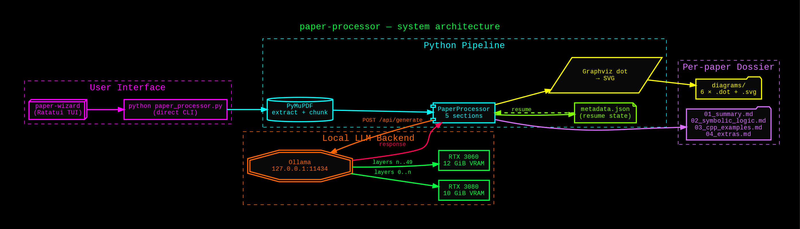
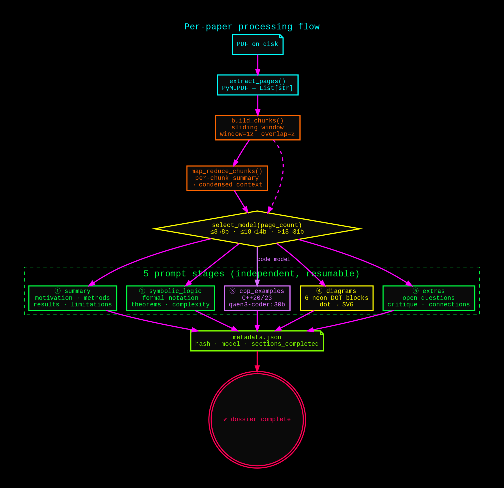
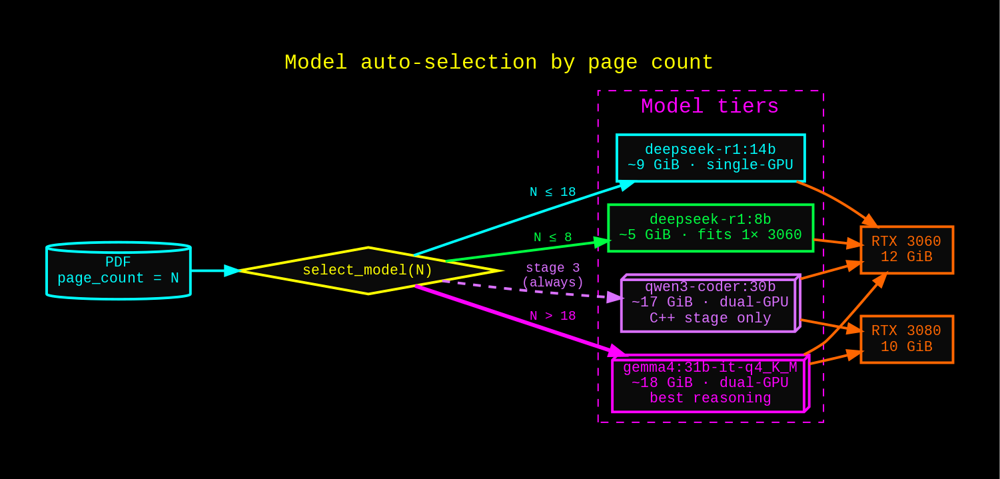
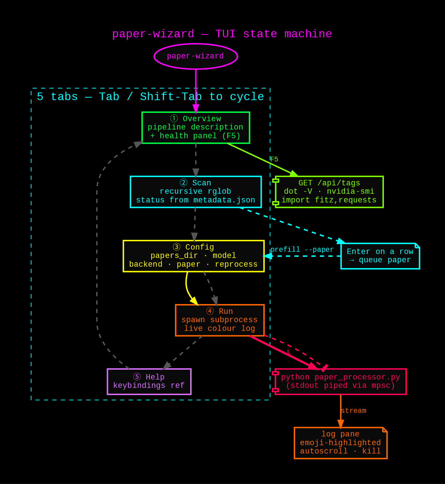

# paper-processor

A two-part pipeline for turning an AI/ML research-paper PDF corpus into
structured study dossiers using local LLMs:

- **`paper_processor.py`** — Python pipeline. For each PDF it produces a
  comprehensive summary, a formal-logic refactor, C++20/23 reference
  implementations of the key algorithms, six Graphviz diagrams (neon
  on black), and a critical-analysis doc. Metadata tracks progress so
  runs are resumable across interruptions.
- **`wizard/`** — [Ratatui](https://ratatui.rs/) TUI (`paper-wizard`)
  that explains the pipeline, scans your corpus, configures the run,
  launches the Python process, and streams its log with syntax colour.

Everything runs locally against [Ollama](https://ollama.com/); there is
no cloud dependency.


## How it works

### System architecture

The wizard (or a direct CLI call) drives the Python pipeline; the pipeline
talks to Ollama over localhost; Ollama auto-schedules layers across both
GPUs; outputs land in a mirrored dossier tree.



### Per-paper processing flow

Each PDF is extracted, chunked with a sliding window (only if it exceeds
12 pages), condensed via map-reduce, then run through five independent
prompt stages. Every stage writes its marker to `metadata.json`, so
partial runs resume exactly where they left off.



### Model auto-selection

Page count picks the model tier. The C++ stage always runs on the
code-specialised model regardless of length. `num_gpu` is intentionally
left unset so Ollama can split the 30B models across the 3080+3060 pair
at 32k context without OOMing.



### Wizard state machine

Five tabs cycle with `Tab` / `Shift-Tab`. `F5` re-probes the environment.
`Enter` on a Scan row queues that paper into Config; `L` launches the
Python subprocess from the Run tab; `X` kills it.



> All four diagrams are in [`docs/diagrams/`](docs/diagrams/) as both `.dot`
> sources and rendered `.svg` / `.png` — regenerate any of them with
> `dot -Tpng -Gdpi=140 -o foo.png foo.dot`.


## Output per paper

```
_processed/<subfolder>/<slug>/
├── 01_summary.md              # motivation → results → limitations
├── 02_symbolic_logic.md       # formal notation, theorems, complexity
├── 03_cpp_examples.md         # C++20/23 implementations, compilable
├── 04_extras.md               # open questions, critique, connections
├── diagrams/
│   ├── 01_<title>.dot + .svg  # architecture
│   ├── 02_<title>.dot + .svg  # data flow
│   ├── 03_<title>.dot + .svg  # algorithm flowchart
│   ├── 04_<title>.dot + .svg  # taxonomy
│   ├── 05_<title>.dot + .svg  # training loop
│   └── 06_<title>.dot + .svg  # vs prior art
└── metadata.json              # model, hash, sections completed
```

## Hardware targets

Written for a dual-GPU workstation (validated on RTX 5080 16 GB + RTX 3080
10 GB). Models auto-route by page count:

| Pages | Model | VRAM |
|---|---|---|
| ≤ 8 | `deepseek-r1:8b` | ~5 GB |
| ≤ 18 | `deepseek-r1:14b` | ~9 GB |
| > 18 | `qwen3.6:35b` | ~23 GB |
| C++ stage | `qwen3-coder:30b` | ~18 GB dual-GPU |

## CLI flags

```
python paper_processor.py [papers_dir]
    --backend {ollama,openclaw}   default ollama
    --model MODEL                 force one model for every stage
    --paper FILENAME              single paper (basename or rel path)
    --reprocess SECTION           summary|logic|cpp|diagrams|extras|all
    --workers N                   parallel papers (⚠ VRAM)
    --ctx TOKENS                  context length [default: 8192]
    --no-flash                    (ignored for Ollama — use OLLAMA_FLASH_ATTENTION env var)
    --kv-cache {q8_0,f16,f32}     (ignored for Ollama — use OLLAMA_KV_CACHE_TYPE env var)
    --single-runner               keep_alive=0 after every request (minimizes VRAM churn)
    --list                        show status table, exit
    --override                    evict loaded Ollama models; restart service if stuck
```

## Performance Tuning for RTX 5080 + 3080

This fork implements optimizations to resolve **Ollama VRAM scheduling churn** on mixed-GPU setups.

### Recommended Ollama Service Configuration

For best results, edit your Ollama systemd override:

```bash
sudo systemctl edit ollama.service
```

And add the following:

```ini
[Service]
Environment="OLLAMA_MAX_LOADED_MODELS=1"
Environment="OLLAMA_NUM_PARALLEL=1"
Environment="OLLAMA_CONTEXT_LENGTH=8192"
Environment="OLLAMA_FLASH_ATTENTION=1"
Environment="OLLAMA_KV_CACHE_TYPE=q8_0"
```

Then reload and restart:

```bash
sudo systemctl daemon-reload
sudo systemctl restart ollama
```

### Pipeline Optimizations

The pipeline now supports the following tuning options:
- **`--ctx 8192`**: Conservative context length reduces KV cache pressure.
- **`--single-runner`**: Sets `keep_alive=0` on Ollama requests, forcing immediate eviction of models after use. This prevents two models from competing for VRAM during transitions.
- **`--kv-cache q8_0`**: Reduces KV cache memory footprint by 50% compared to f16.
- **`--no-flash`**: Disables Flash Attention if your hardware doesn't support it (default is ON).

## Forks

| Directory | Model change | Rationale |
|-----------|-------------|-----------|
| [`fork_2026-05-15T235801Z/`](./) | **Performance Optimization** | Optimized for RTX 5080 + 3080 mix. Added flags for `--ctx`, `--kv-cache`, and `--single-runner` to fix VRAM scheduling churn. |
| [`fork_gptOSS_textonly_2026-05-14T205304Z/`](../fork_gptOSS_textonly_2026-05-14T205304Z/) | `xl_quality`: `gemma4:31b-it-q4_K_M` → `gpt-oss:20b` | Pipeline is text-only. Gemma 4's multimodal capacity is never exercised; `gpt-oss:20b` reclaims ~6 GB VRAM on the dual-GPU pool. |

Each fork carries its own `docs/sessions/` log and a `README.md` describing the
change. Routing thresholds, prompts, and checkpointing are identical to the
parent unless otherwise noted.

## Licence

MIT
